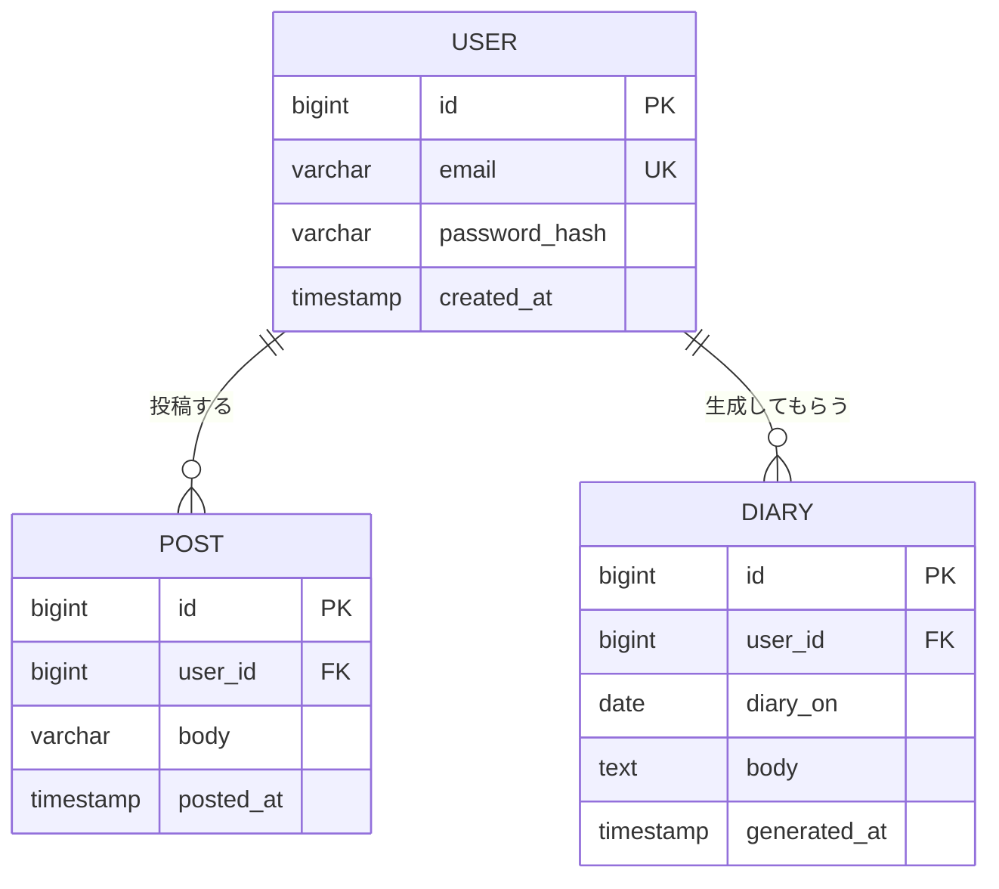

# フェーズ1 実装仕様

`phases.md`のフェーズ1(8項目)を、実装に着手できる粒度まで詳細化したもの。ドメインモデル・パッケージ構成・コーディング規約は`CLAUDE.md`に、コンセプト・AIのトーンは`mymanifesto.md`に準拠する。

対象範囲: ログイン/ログアウト、つぶやきのCRUD、日記の生成・再生成。ユーザー登録UI・過去日記閲覧・通知・任意日付生成は対象外(9節参照)。

## 1. データモデル

### エンティティ

#### User(`domain/User.java`)

| フィールド | 型 | 備考 |
|---|---|---|
| id | Long | PK |
| email | String | ログインID。unique |
| passwordHash | String | BCryptハッシュ |
| createdAt | Instant | 作成日時 |

#### Post(`domain/Post.java`)— つぶやき

| フィールド | 型 | 備考 |
|---|---|---|
| id | Long | PK |
| user | User | `@ManyToOne` |
| body | String | 100文字以内。`@Size(max = 100)` |
| postedAt | Instant | 投稿時刻。作成時に`Clock`から自動付与し、編集時も変更しない |

#### Diary(`domain/Diary.java`)— 日記

| フィールド | 型 | 備考 |
|---|---|---|
| id | Long | PK |
| user | User | `@ManyToOne` |
| diaryOn | LocalDate | 対象日。`(user_id, diary_on)`にユニーク制約。列名は`diary_on`とし、SQL予約語`DATE`との衝突を避ける(下記の命名規則を参照) |
| body | String | AIが生成した本文 |
| generatedAt | Instant | 生成(再生成)日時。再生成のたびに更新 |

### 関係性

- User 1 : N Post — 1ユーザーが複数のつぶやきを持つ。上限なし。
- User 1 : N Diary — ただし`(user_id, diary_on)`が一意なため、実質「1ユーザー・1日につき1本」に制約される。
- DiaryはPostへの直接の外部キーを持たない。生成時に対象ユーザー・対象日付のPostを検索して集約する(スナップショットとして本文に焼き込む)。

### ER図



`DIARY`の`(user_id, diary_on)`は複合ユニーク制約(1ユーザー・1日につき1本)。Mermaidの`erDiagram`は複合キーを直接表現できないため、この制約はFlywayマイグレーション側(下記`V3__create_diaries_table.sql`)で表現する。`POST`から`DIARY`への直接の外部キーは持たない(関係性の節を参照)。

**命名・型の方針:**

- 各テーブルの`id`列は、DB固有の`SERIAL`/`AUTO_INCREMENT`ではなく、SQL標準(SQL:2003)の`GENERATED ALWAYS AS IDENTITY`で自動採番する。特定のDBに依存しない、移植性のある書き方を優先する。
- 日付のみを持つ列(時刻を持たない列)は`_on`、日時(タイムスタンプ)を持つ列は`_at`で統一する(`diary_on`、`created_at`、`posted_at`、`generated_at`)。これにより、SQL予約語`DATE`と紛らわしい`diary_date`のような名前を避ける。

### Flywayマイグレーション(`src/main/resources/db/migration/`)

- `V1__create_users_table.sql` — `users`テーブル作成(`id`は`GENERATED ALWAYS AS IDENTITY`、`email` unique)
- `V2__create_posts_table.sql` — `posts`テーブル作成(`id`は`GENERATED ALWAYS AS IDENTITY`)、`users`へのFK、`(user_id, posted_at)`にインデックス
- `V3__create_diaries_table.sql` — `diaries`テーブル作成(`id`は`GENERATED ALWAYS AS IDENTITY`)、`users`へのFK、`(user_id, diary_on)`にユニーク制約
- `V4__seed_initial_user.sql` — 初期ユーザーを1件INSERT(2節参照)

## 2. 認証方針

- ログイン方式: メールアドレス(email)+ パスワードによるフォームログイン(Spring Security標準の`formLogin`)。
- パスワードは`BCryptPasswordEncoder`でハッシュ化して`users.password_hash`に保存し、平文では一切保持しない。
- **初期ユーザーの用意方法**: フェーズ1にはユーザー登録UIがないため、`V4__seed_initial_user.sql`で1件のユーザーを直接INSERTする。パスワードハッシュは開発時に`BCryptPasswordEncoder`で生成した値をSQLに直書きし、元の平文パスワードはマイグレーションにもコードにも残さず開発者間で別途共有する。
- `security/TsumoryUserDetailsService.java`が`UserRepository.findByEmail`でユーザーを検索し、`security/TsumoryUserDetails.java`(`UserDetails`実装、ドメインの`User`をラップし`getId()`を公開)を返す。
- ログイン後は`/posts`へ遷移する。ログアウトは標準の`POST /logout`(CSRFトークン必須)。
- `/login`と静的リソース(`/webjars/**`など)以外はすべて認証必須とする(`config/SecurityConfig.java`)。

## 3. 画面一覧

フェーズ1の画面は**ログイン・今日のつぶやき・日記表示の3画面**に統一する。つぶやきの編集は別画面を設けず、「今日のつぶやき」画面内の編集モードとして実現する(5節・7節参照)。

| 画面 | URL | 認証 | 内容 |
|---|---|---|---|
| ログイン画面 | `GET /login` | 未認証のみアクセス可 | メールアドレス・パスワードによるログインフォーム |
| 今日のつぶやき画面(ホーム) | `GET /posts` | 要認証 | 当日のつぶやき一覧(時系列)、投稿フォーム、つぶやきの編集モード、日記生成ボタン/日記画面へのリンク |
| 日記表示画面 | `GET /diary/{date}` | 要認証・本人のみ・`date`は当日のみ | 当日の日記本文の表示、作り直すボタン |

## 4. エンドポイント一覧

| メソッド | パス | 内容 | 認証 |
|---|---|---|---|
| GET | `/` | `/posts`へリダイレクト | 要認証(未認証時は`/login`へ) |
| GET | `/login` | ログイン画面表示 | 不要 |
| POST | `/login` | ログイン処理(Spring Security標準フィルタが処理、独自コントローラは持たない) | 不要 |
| POST | `/logout` | ログアウト | 要認証 |
| GET | `/posts` | 今日のつぶやき画面(通常表示) | 要認証 |
| GET | `/posts?edit={id}` | 今日のつぶやき画面を、`id`のつぶやきのみ編集モードで表示(別画面ではなく同一画面の状態切り替え) | 要認証・本人のみ |
| POST | `/posts` | つぶやき新規投稿 | 要認証 |
| POST | `/posts/{id}` | つぶやき本文の更新。保存後は`/posts`(通常表示)へリダイレクト | 要認証・本人のみ |
| POST | `/posts/{id}/delete` | つぶやき削除 | 要認証・本人のみ |
| GET | `/diary/{date}` | 日記表示画面。`date`が当日以外の場合は404 | 要認証・本人のみ |
| POST | `/diaries/generate` | 当日の日記を生成/再生成(upsert)。成功後は`/diary/{今日の日付}`へリダイレクト | 要認証 |

## 5. 各機能の振る舞いと制約

### つぶやき投稿

- 本文は1〜100文字。空白のみの投稿は不可(`@NotBlank` + `@Size(max = 100)`)。
- 投稿時刻(`postedAt`)は`Clock`(Asia/Tokyo)から自動付与する。クライアントからの指定は受け付けない。
- 1日あたりの投稿数に上限は設けない(SNS感覚で気軽に積もらせることがコンセプトの核のため、意図的に無制限)。
- 投稿は必ずログイン中のユーザー本人に紐づく。

### つぶやき編集

- **別画面を設けず、「今日のつぶやき」画面内の編集モードとして実現する**。`GET /posts?edit={id}`で該当のつぶやきだけが編集フォーム表示に切り替わり、それ以外のつぶやきは通常表示のままとする。
- 本文のみ変更可能。`postedAt`は変更しない。
- 自分の投稿のみ編集できる。他人の投稿IDを指定した場合は404を返す(所有権のないリソースの存在を漏らさない)。
- 文字数制約は投稿時と同じ(1〜100文字)。
- 保存(`POST /posts/{id}`)後は編集モードを終了し、`/posts`の通常表示に戻る。キャンセル時は`GET /posts`へ戻るだけでよい。

### つぶやき削除

- 自分の投稿のみ削除できる。他人の投稿IDを指定した場合は404を返す。
- 削除確認はクライアント側の簡易確認(`confirm()`)で十分とし、専用の確認画面は作らない。
- 削除の取り消し(ゴミ箱・復元)機能はフェーズ1では持たない。

### 日記生成・再生成・表示

- 1ユーザー・1日につき日記は常に1本。生成と再生成は`POST /diaries/generate`の同一エンドポイントでupsertする(初回は作成、既にあれば上書き)。
- 生成対象は常に「当日」のみ。任意の過去日付を指定した生成はできない(`Clock`から算出した当日の日付境界で判定)。
- 生成・再生成に成功したら`/diary/{今日の日付}`(日記表示画面)へリダイレクトする。
- 当日のつぶやきが0件の場合は生成せず、「今日はまだつぶやきがありません」とエラーメッセージを表示して`/posts`に戻す。
- 再生成の回数に上限は設けない(「しっくりこなければ何度でも作り直せる」がコンセプトの核のため)。
- Anthropic API呼び出しが失敗した場合(タイムアウト、レート制限など)は例外を捕捉し、「日記の生成に失敗しました。時間をおいて試してください」とフラッシュメッセージを出す。失敗時は既存の日記を変更しない。
- 生成失敗時の自動リトライは行わない(ユーザーが「作り直す」を押し直せば十分なため)。
- `GET /diary/{date}`は`date`が当日以外の場合404を返す。日記表示画面は本人の当日分しか閲覧できず、過去日記の閲覧・カレンダー的な導線は用意しない(9節参照)。
- Claude API呼び出しには数秒〜十数秒程度かかる想定とする。生成・再生成中はローディング表示を行い、ボタンを無効化して二重押下を防ぐ(7節参照)。`(user_id, diary_on)`のupsertにより多重リクエストが来ても結果は安全だが、無駄なAPI呼び出し・二重課金を避けるためクライアント側でも防止する。

## 6. AI連携(`service/AnthropicDiaryWriter.java`)

- CLAUDE.mdの方針に従い、専用パッケージには分けず`service/`直下に置く。
- モデルは`application.yaml`の設定値(例: `tsumory.ai.model`)で指定し、デフォルトは`claude-haiku-4-5`とする(コスト最小・デモ用途のため。品質を優先する場合は設定値の変更のみで上位モデルに切り替えられるようにする)。
- APIキーは`ANTHROPIC_API_KEY`環境変数から解決する。コード・設定ファイル(`application.yaml`含む)には一切書かない。
- システムプロンプトには`mymanifesto.md`の「AIのトーン」をそのまま反映する: 書き手ではなくそばで話を聞いていた人のように、断定せず本人の言葉や温度感を尊重し、評価や説教をしない、肩の力を抜いたトーン。
- ユーザーメッセージには当日のつぶやきを投稿時刻付きで時系列に並べて渡し、「これらのつぶやきを1本の日記としてまとめる」よう指示する。
- 出力は日記本文のみのプレーンテキスト(見出しや箇条書きにしない、一人称の自然な文章)とする。

## 7. 画面設計

各画面の構成要素を示す。テンプレートは`src/main/resources/templates/`配下に置く。

### 共通レイアウト(`fragments/layout.html`)

- Bootstrap 5を適用したベースレイアウト。navbarにサービス名「Tsumory」と、ログイン中のみログアウトボタンを表示する。
- フラッシュメッセージ(成功・エラー)の共通表示領域を持ち、各画面はこのフラグメントを利用する。

### ログイン画面(`login.html`)

- 画面中央にカード形式のログインフォームを配置する。
- 入力項目: メールアドレス、パスワード。
- ログイン失敗時はSpring Securityの`?error`パラメータを検知し、「メールアドレスまたはパスワードが正しくありません」と表示する。
- ユーザー登録リンクは置かない(9節の通りフェーズ1ではユーザー登録UIを持たないため)。

### 今日のつぶやき画面(ホーム、`posts/index.html`)

`GET /posts`に対応する、フェーズ1のメイン画面。上から以下の順でセクションを配置する。通常表示と編集モードは同一テンプレート内で切り替える(つぶやき編集専用の画面は持たない)。

1. **投稿フォーム**: `textarea`(`maxlength="100"`)+投稿ボタンのみのシンプルな1行フォーム。SNS感覚で気軽に投稿できることを優先する。バリデーションエラー時はフォーム直下にエラーメッセージ(「100文字以内で入力してください」など)を表示する。
2. **当日のつぶやき一覧**: 投稿時刻(`HH:mm`)昇順で表示する。各行は次のいずれかの状態を取る。
   - **通常表示**(既定): 本文・投稿時刻・「編集」ボタン・「削除」ボタン(`confirm()`で確認)。
   - **編集モード**(`GET /posts?edit={id}`でその行のみ切り替え): 本文を初期値としたテキストエリア(`maxlength="100"`)、投稿時刻は変更不可であることが分かるよう読み取り専用表示、「保存」ボタン(`POST /posts/{id}`)と「キャンセル」リンク(`/posts`へ戻る)。他の行は通常表示のままとする。
   - つぶやきが0件の場合は「まだ何も積もっていません」のような空状態メッセージを表示する。
3. **日記への導線**:
   - 当日の日記が未生成の場合: 「今日の日記を作る」ボタン(`POST /diaries/generate`)を表示する。当日のつぶやきが0件の場合はボタンを無効化(disabled)し、「つぶやきを投稿すると日記が作れます」と案内する。生成成功時は`/diary/{今日の日付}`へ遷移する。
   - 当日の日記が生成済みの場合: 「今日の日記を見る」リンク(`GET /diary/{今日の日付}`)を表示する。
   - Claude API呼び出しには数秒〜十数秒かかる想定のため、フォーム送信時にJSでボタンをスピナー付きの「生成中…」表示に切り替えて無効化する(Bootstrapの`spinner-border`など)。非同期(Ajax)化はせず、通常のフォーム送信+ページ遷移のまま、ボタンの見た目変更のみでローディングを表現する(JSは最小限に留める方針。7節冒頭・9節参照)。これにより二重押下も同時に防止する。

### 日記表示画面(`diary/show.html`)

`GET /diary/{date}`に対応する画面。`date`は当日の日付のみ有効で、それ以外を指定した場合は404を返す(過去日記の閲覧はフェーズ2で扱う。9節参照)。

- 日記本文と生成日時を表示する。編集用のUI(テキストエリアなど)は置かない(9節の通り手動編集は不可のため)。
- 「作り直す」ボタン(`POST /diaries/generate`)。再生成後は同じ`/diary/{今日の日付}`に留まり、更新後の本文を表示する。
- 「作り直す」ボタンも今日のつぶやき画面の生成ボタンと同様に、クリック時にスピナー付きの「作り直しています…」表示へ切り替えて無効化する(実装は共通化してよい)。これにより二重押下も防止する。
- ホーム(`/posts`)へ戻るリンクを配置する。
- 生成に失敗した場合は、既存の日記表示を維持したまま、フラッシュメッセージ領域にエラーを表示する(9節の通りリトライはしない)。

## 8. パッケージ配置

```
domain/     User, Post, Diary
repository/ UserRepository, PostRepository, DiaryRepository
form/       PostForm
controller/ PostController(/ の redirect、今日のつぶやき画面と編集モードを含む), DiaryController(日記表示画面、生成/再生成を含む)
service/    PostService, DiaryService, AnthropicDiaryWriter
security/   TsumoryUserDetails, TsumoryUserDetailsService
config/     SecurityConfig, ClockConfig, AnthropicConfig(Anthropicクライアントの@Bean定義)
```

## 9. やらないこと(スコープ外)

`phases.md`に記載の通り、以下はフェーズ1に含めない。

- ユーザー登録UI(初期ユーザーはマイグレーションで投入)
- 過去日記の閲覧・カレンダー表示。`GET /diary/{date}`は当日以外の`date`を404にすることで、URLがdateパラメータを持ちながらも過去日記の閲覧はできないようにする。
- 通知・リマインド
- 任意日付での日記生成(生成対象は常に当日のみ)
- 日記の手動編集。生成された本文を直接書き換える機能は持たず、しっくりこない場合は`POST /diaries/generate`による再生成(上書き)のみで対応する(3節・7節の日記表示画面に編集UIが存在しないのはこのため)。
- つぶやき編集専用の画面。「今日のつぶやき」画面内の編集モード(`GET /posts?edit={id}`)のみで対応し、独立したURL・テンプレートは持たない。
- Claude API呼び出し失敗時の自動リトライ。失敗時はエラーメッセージをユーザーに表示するのみとし、再試行するかどうかはユーザーが「作り直す」を押し直すかどうかに委ねる(5節参照)。
